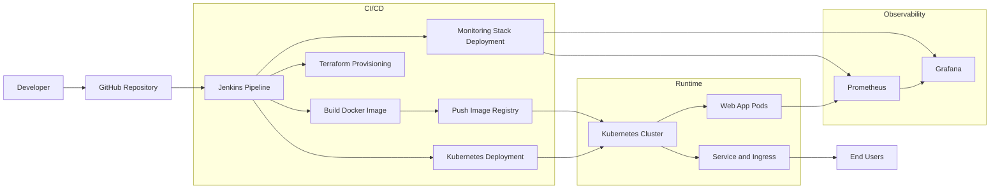

# End-to-End DevOps Architecture

```mermaid
flowchart LR
    A[Developer] --> B[GitHub Repository]
    B --> C[Jenkins Pipeline]

    subgraph CI/CD
      C --> D[Build Docker Image]
      D --> E[Push Image Registry]
      C --> F[Terraform Provisioning]
      C --> G[Kubernetes Deployment]
      C --> H[Monitoring Stack Deployment]
    end

    subgraph Runtime
      E --> I[Kubernetes Cluster]
      G --> I
      I --> J[Web App Pods]
      I --> K[Service and Ingress]
    end

    subgraph Observability
      H --> L[Prometheus]
      H --> M[Grafana]
      J --> L
      L --> M
    end

    K --> N[End Users]
```
